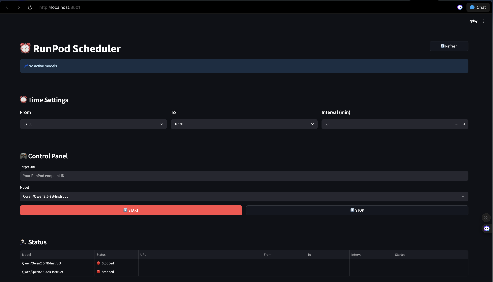
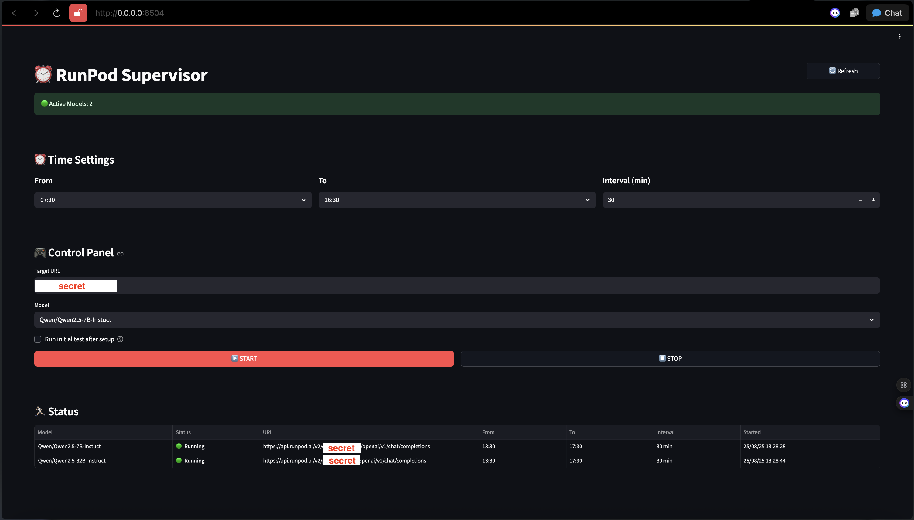
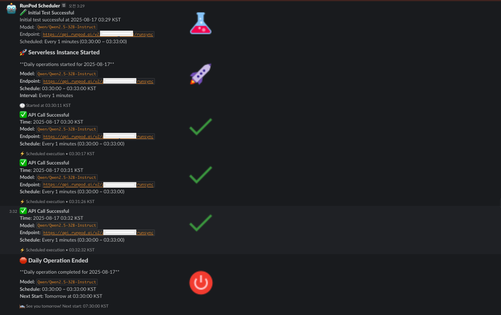

# RunPod Serverless Scheduler

A tool for managing RunPod serverless model scheduling with a Streamlit web interface.

## 🎯 Project Overview

**Problem**: RunPod serverless models suffer from cold start issues, which means they take time to activate when receiving the first request.

**Solution**: This project sends periodic requests to keep serverless models "warm" and ready for inference, significantly reducing response times.

**Architecture**:
- **Streamlit Frontend**: Easy-to-use web interface for configuration
- **Cronjob Scheduler**: Sends periodic requests to RunPod serverless inference servers
- **Slack Integration**: Reports scheduling results and status updates to Slack channels

## 🚀 Quick Start

### 1. Install Dependencies

```bash
pip install --upgrade pip

python -m venv runpod-serverless-supervisor
source runpod-serverless-supervisor/bin/activate

# Install runtime dependencies
pip install -e .

# For development (includes code quality tools)
pip install -e ".[dev]"
```

### 2. Environment Setup
```bash
cp template/settings.example.json config/settings.json
cp template/.env.example .env
```

**Configure `config/settings.json`** for UI defaults and available models:
- `ui.max_interval`: Maximum interval allowed in minutes (default: 1440)
- `ui.default_from_time`: Default start time for schedules (default: "07:30")
- `ui.default_to_time`: Default end time for schedules (default: "16:30")
- `ui.default_interval`: Default interval in minutes (default: 60)
- `ui.auto_refresh_seconds`: UI refresh rate in seconds (default: 5)
- `ui.timezone`: Default timezone for scheduling (default: "Asia/Seoul")
- `models`: Array of available RunPod model names to choose from

**Configure `.env` file** with your actual values:
- `RUNPOD_API_KEY`: Your RunPod API key (required)
- `SLACK_WEBHOOK_URL`: Slack webhook URL (optional)
- `SLACK_ENABLED`: Enable/disable Slack notifications (default: true)
- `SLACK_CHANNEL`: Slack channel for notifications (default: #runpod-alerts)
- `SLACK_USERNAME`: Bot username (default: RunPod Scheduler)
- `SLACK_ICON_EMOJI`: Bot emoji (default: :robot_face:)

### 3. Run Web App
```bash
streamlit run web_interface.py
```

It will open automatically in your browser or access http://localhost:8501.

The page may appear as follows:




## 💻 Usage

### In the Web Interface:

1. **Time Settings**
   - From: Schedule start time (default: 07:30)
   - To: Schedule end time (default: 16:30)
   - Interval: Call interval in minutes (default: 60 minutes)

2. **Model Configuration**
   - Target URL: Enter RunPod endpoint ID
   - Model: Select model to use

3. **Scheduler Control**
   - ▶️ START: Start scheduler
   - ⏹️ STOP: Stop scheduler

4. **Status Monitoring**
   - Real-time active model count
   - Detailed status table for each model

### Example Workflow

Here's how the scheduler works in practice:

1. **Configure and Start**: Set your schedule (e.g., 3:30 AM to 3:33 PM every minute) and press START
2. **Status Updates**: The status table immediately shows "🟢 Running" for your model



3. **Automatic Scheduling**: Between 3:30 AM and 3:33 PM, requests are sent every minute to keep your serverless model warm
4. **Slack Notifications**: All scheduling activities are logged to Slack in real-time



5. **Persistent Operation**: The scheduler continues running daily until you stop it or terminate the Streamlit app

## 📊 Features

- **Cold Start Prevention**: Keep serverless models warm with periodic requests
- **Real-time Monitoring**: Automatic status updates with live dashboard
- **Multi-model Support**: Schedule multiple models simultaneously
- **Automatic Cronjob Management**: Persists through system restarts
- **Immediate Testing**: Performs connection test immediately on START
- **Slack Integration**: Real-time notifications for status updates and errors
- **Configurable Timezone**: Support for multiple timezones worldwide
- **Intuitive UI**: Color-coded status indicators with Streamlit interface

## 📁 Project Structure

```
runpod-serverless-setup/
├── web_interface.py         # Streamlit web app (main)
├── runpod_cronjob.py       # Cronjob execution script
├── core/
│   ├── env_settings.py     # Environment & settings management
│   ├── scheduler_manager.py # Scheduler configuration management
│   └── runpod_api.py       # RunPod API client
├── utils/
│   ├── cronjob_utils.py    # Cronjob management utilities
│   └── slack_utils.py      # Slack notification utilities
├── config/
│   ├── settings.json       # UI settings & model list
│   └── scheduler_config.json # Dynamic scheduler state (auto-generated)
├── template/
│   ├── settings.example.json # Settings template file
│   └── .env.example          # Environment variables template
├── .env                    # Environment variables (API keys, Slack config)
├── requirements.txt        # Package dependencies
└── runpod_cronjob.log      # Cronjob execution logs (auto-generated)
```

## ⚙️ Configuration Files

- **`.env`**: Contains API keys and Slack webhook configuration
- **`config/settings.json`**: UI defaults, model list, and timezone settings
- **`config/scheduler_config.json`**: Dynamic scheduler state (auto-generated)

All configurations are managed through the web interface.

## 🔧 Troubleshooting

### Common Issues
- **Buttons not responding**: Refresh the page in your browser
- **Cronjob not working**: Check system cron service status with `systemctl status cron`
- **API connection failed**: Verify Target URL and model settings in the web interface
- **Timezone issues**: Check timezone setting in `config/settings.json`
- **Slack notifications not working**: Verify `SLACK_WEBHOOK_URL` in `.env` file

### Logs and Debugging
- **Cronjob logs**: Check `runpod_cronjob.log` for execution details
- **Streamlit logs**: Check terminal output where web app is running
- **Configuration issues**: Verify all files in `config/` directory exist

### Requirements
- **Python**: 3.8 or higher
- **System**: macOS, Linux (Windows with WSL)
- **Dependencies**: All packages listed in `requirements.txt`

## 🚀 Development

### Code Quality Tools
This project uses automated code quality tools:

```bash
# Install development dependencies
pip install -r requirements-dev.txt

# Install pre-commit hooks
pre-commit install

# Run code formatting and linting
ruff check .          # Linting
ruff format .         # Formatting
black .               # Additional formatting
isort .               # Import sorting

# Run all pre-commit hooks manually
pre-commit run --all-files

# Security check
bandit -r .
```

### GitHub Actions
The repository includes CI/CD workflows that automatically:
- Run code linting and formatting checks
- Perform security scans
- Validate code quality on every push and PR

---

**Quick Start**: Simply run `streamlit run web_interface.py` to access all features.
